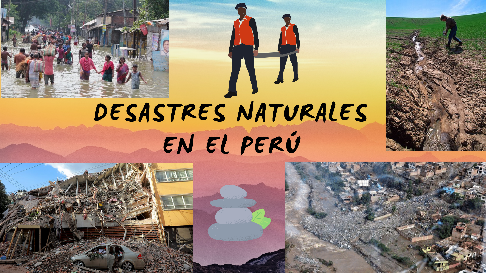
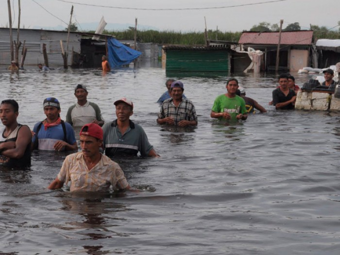
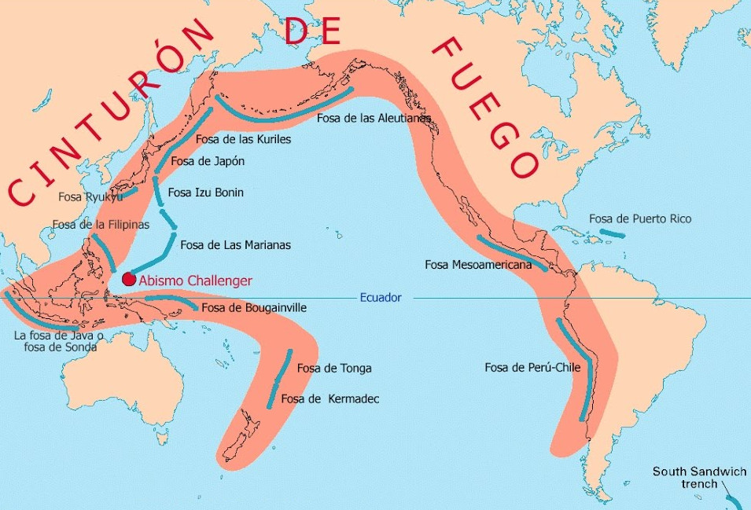
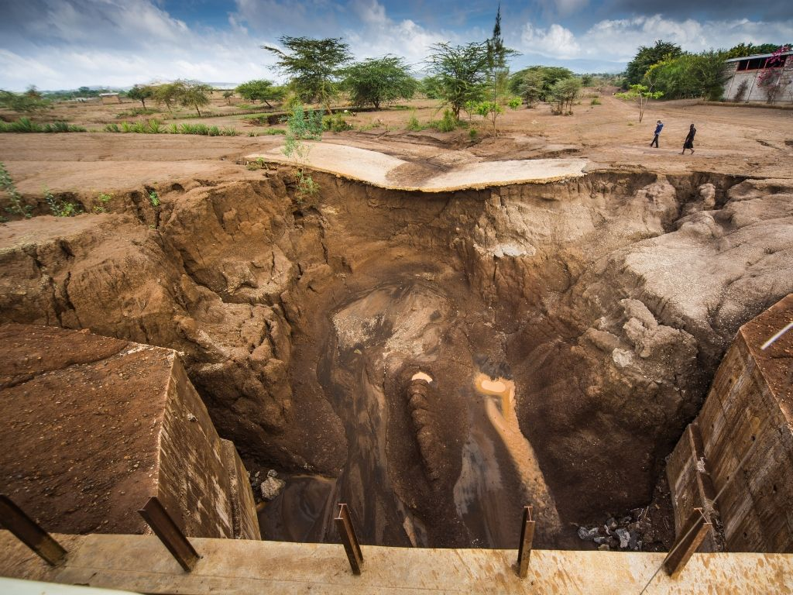
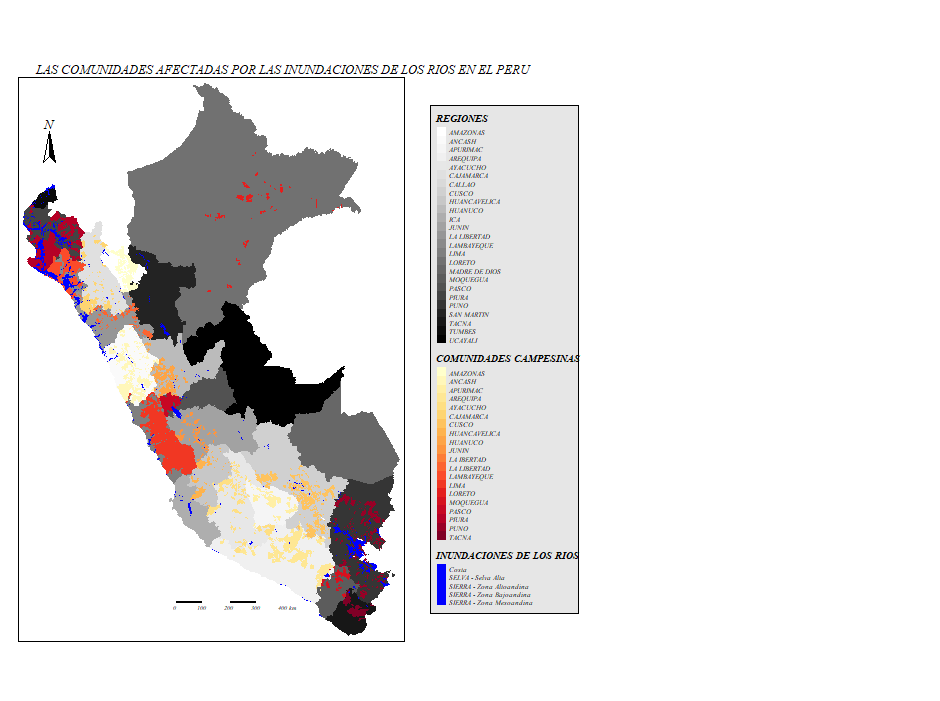
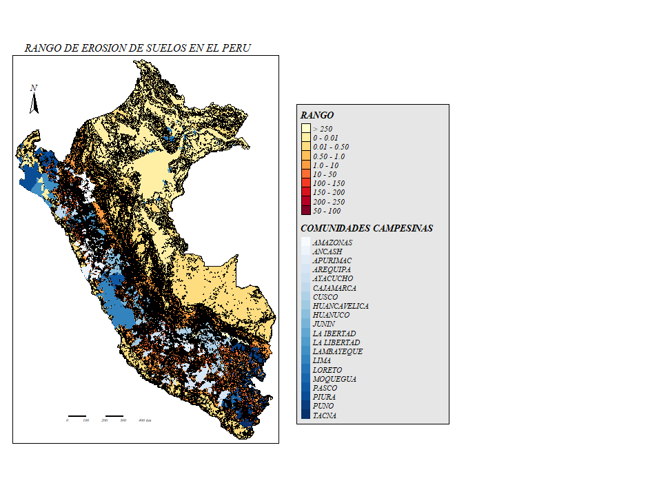

# ANÁLISIS DE LOS EFECTOS CAUSADOS POR  INUNDACIONES, SISMOS Y EROSIÓN DE SUELOS EN  POBLACIONES CAMPESINAS EN EL PERÚ
## Integrantes:
- Arratia Parez, Eduardo
- Lázaro Sapallanay, Anderson
- Medina Enriquez, Juan Daniel
- Torres Meza, Lizbeth

___

## 1.INTRODUCCIÓN
El Perú se encuentra situado en la parte central y occidental de
América del sur, con una extensión 1,285.216 km.Según el
último censo del año 2017 cuenta con 31,44  millones de
habitantes. La población urbana equivale al 76% y la población
rural al 24% del total.

- Por su ubicación geográfica y por factores como: La Cordillera de los Andes que atraviesa el territorio longitudinalmente,  por la Corriente  Peruana
de Humboldt, por el Anticiclón del Pacifico Sur; lo cual da como
resultado un clima diversificado.

- Las mayores ciudades se encuentran en la costa, como Piura,
Chiclayo, Trujillo, Chimbote, Lima e  Ica. El 54,6% de la población peruana vive en la costa, el
32,0% en la sierra, y el 13,4% en la selva. 
- Además, la costa peruana está afectada por el cruce de dos placas tectónicas: la de Nazca y la sudamericana, provocando, en su fricción, los sismos. 

Entonces podemos decir que el Perú es un país susceptible a diferentes desastres naturales propios de su geografía, tales como inundaciones, sismos y erosión lo que ocasiona una perturbación  en su medio ambiente, economía, perdidas humanas, y salud de la población; lo que significa una influencia negativa en estas comunidades.

 | 

|

## 2.FINALIDAD
La finalidad de este proyecto es demostrar  si existe una influencia negativa de los desastres naturales hacia las  comunidades campesinas.
- **Delimitación de estudio**: Este trabajo  de análisis se basa en los datos obtenidos de  erosión de suelos, áreas inundables y sismos del año 2014 en el Perú.
- **Justificación e importancia**:

 Los desastres naturales (inundaciones, sismos y erosión de suelos) son uno de los problemas que afronta nuestro país, es un hecho que existen diversos tipos desastres y cada una debe ser afrontada con diversas y distintas medidas. Este trabajo se enfoca en la recolección y análisis de datos  Shapefile (SHP) sobre los desastres que se vienen dando en nuestro país. Actualmente se tiene como un objetivo analizar las influencias negativas que presentan frente a las comunidades campesinas. 
El presente trabajo aportará información para realizar planes de solución ante esta problemática en nuestro país, o estudios sobre gestión de riesgo en las comunidades campesinas.
## 3.OBJETIVOS
- **General:**
Algunos desastres naturales  influyen negativamente en las comunidades campesinas del Perú.
- **Específicos:**
  -  Demostrar la influencia negativa de las inundaciones en las poblaciones campesinas.
  - Demostrar la influencia negativa de los sismos en las poblaciones campesinas.
  - Demostrar la influencia negativa de la erosión de los suelos en las poblaciones campesinas.

___
## 4. HIPÓTESIS Y VARIABLES
- **Hipótesis General:**
los desastres naturales influyen negativamente en las poblaciones campesinas.
- **Hipótesis específicos:**
  - La influencia generada por las inundaciones es negativa.
  - La influencia generada por los sismos es negativa.
  - La influencia generada por la erosión de los suelos es negativa.

-  **Variables**
   - Cualitativa:Población de comunidades campesinas en el Perú.
   - Cuantitativa:Rango de erosión en el Perú.
   - Cualitativa:Regiones inundables en el Perú.
   - Cualitativa:Zonas de sismos en el Perú.

## 5. METODOLOGÍA
- **Diseño a utilizar en el estudio** :
Se realizó un estudio bibliográfico para la recolección de datos  a traves de las páginas web de [SINPAD](http://sinpad.indeci.gob.pe/sinpad2/faces/public/portal.html), [IGP](https://www.igp.gob.pe/version-anterior/), lo que permitió plantear los objetivos descritos anteriormente.
Es un diseño basado en la recopilación, análisis y presentación de los datos recopilados.
-  Población 
     -  Comunidades de todo el Perú
-  Muestra
     - Comunidades campesinas del Perú
-  Unidad de investigación
     - Una comunidad campesina del Perú    
-  Técnicas de recolección de datos
     - Obtención de datos Shapefile (SHP).
     - Utilización del Software R .
     - Bibliotecas virtuales.
     - Repositorios.

## 6. DISCUSIÓN Y ANÁLISIS DE RESULTADOS REFERENTES AL OBJETIVO/HIPÓTESIS
- Inundaciones

Las inundaciones son fenómenos naturales muy recurrentes en el Perú, y se generan cuando el agua ocupa un terreno que debería estar libre. La forma más recurrente de estimar inundaciones es a través de simulaciones hidráulicas; actualmente existen múltiples investigaciones que utilizan esta metodología por ser la mejor forma para entender la perspectiva física de áreas inundables. 

*Regiones inundables*| *Actividad*
----------------- | --------------------
Costa |Agricultura de bajo riego
Selva alta |Actividad agropecuaria
Sierra-Zona altoandina|Actividad agropecuaria
Sierra-Zona bajoandina|Actividad agropecuaria
Sierra-Zona Mesoandina|Actividad agropecuaria

Como se observa en el mapa las zonas más afectadas por las inundaciones corresponden a  la costa norte que comprende a las regiones de Tumbes, Piura, Lambayeque y La Libertad.Debido a  ello pueden causar daños a las tierras agrícolas, lo que daña los cultivos y el suministro de alimentos . Además el agua que no drena  puede atraer mosquitos y así transmitir enfermedades como el dengue, zika y chikungunya que en conjunto perjudican a las comunidades campesinas.

- Sismos

A nivel mundial, el Perú es uno de los países de mayor potencial sísmico debido a que forma parte del denominado Cinturón de Fuego del Pacífico, región donde la Tierra libera más del 85% de la energía acumulada en su interior debido a los procesos de convección del manto.

En el gráfico se observa que a cada zona se asigna un factor Z según se indica en la Tabla. Este factor se interpreta como la aceleración máxima horizontal en suelo rígido con una probabilidad de 10 % de ser excedida en 50 años. El factor Z se expresa como una fracción de la aceleración de la gravedad.

*Zona*   |  *Z*
------| -------------------
4 | 0.45
3|  0.35
 2|  0.25
1| 0.10

Como se ve en el gráfico, las zonas más propensas a sufrir sismos de gran magnitud es la región costa , lo que afectaría en gran medida a las comunidades campesinas que allí habitan, causando pérdidas humanas y  materiales. Por otro lado la segunda región más afectada por este evento es la sierra y el menos afectado es las selva teniendo una fracción de  aceleración de la gravedad de 0.10 .

- Erosión

*Rango de erosión*| *Establece*
----------------- | -------------------
10 - 50 |muy bajo
50 - 100|bajo 
100 - 150|medio
150 - 200|alto
200 - 250|muy alto
mayor a  250  |extremo

Como se observa en el gráfico, los suelos más erosivos se ubican mayormente en la región sierra y también en  ciertas partes de la costa ,  influyendo negativamente a las comunidades campesinas de ese lugar, causando  infertilidad de los suelos  y con ello la disminución de la productividad agrícola, la calidad medioambiental y sostenibilidad agrícola.

## 7. CONCLUSIONES y/o COMENTARIOS GENERALES

En conclusión, el Perú es un país susceptible a diferentes desastres naturales debido a  su ubicación geográfica,por su morfología y por su estructura geológica. 

El  análisis  realizado demuestra   que los diferentes desastres naturales producen una influencia negativa en las comunidades campesinas y así corroborando las hipótesis planteadas inicialmente.
Es así que  en nuestro país estas comunidades sufren diferentes efectos de estos desastres, lo que los perjudica ocasionando perdida de cultivos, vivendas y por otro lado contrayendo enfermedades causadas por vectores debido a inundaciones.
Es muy importante contar con el apoyo de instituciones públicas como [INDECI](https://www.indeci.gob.pe/emergencias/), [SINPAD](http://sinpad.indeci.gob.pe/sinpad2/faces/public/portal.html), [CENEPRED](http://cenepred.gob.pe/web/), entre otros.Porque ellos son los encargados de prevenir,brindar asistencia técnica y  reducir los riesgos de desastres.
